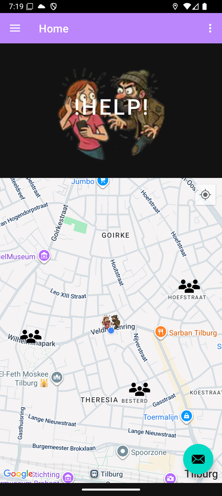

## InterVene Android mobile App

InterVene is a mobile application designed to enhance your personal safety and facilitate community-based vigilance through a user-friendly interface. The app integrates navigation, emergency response features, and group coordination. 
Start a guided trip, and in an emergency, use the help button to alert neighborhood watch members or other alert individuals using the app. The "HELP" emergency button also emits a loud, irritating sound.
You remain 100% anonymous and are only visible to others in an emergency.

## Screenshots

## DEMO

